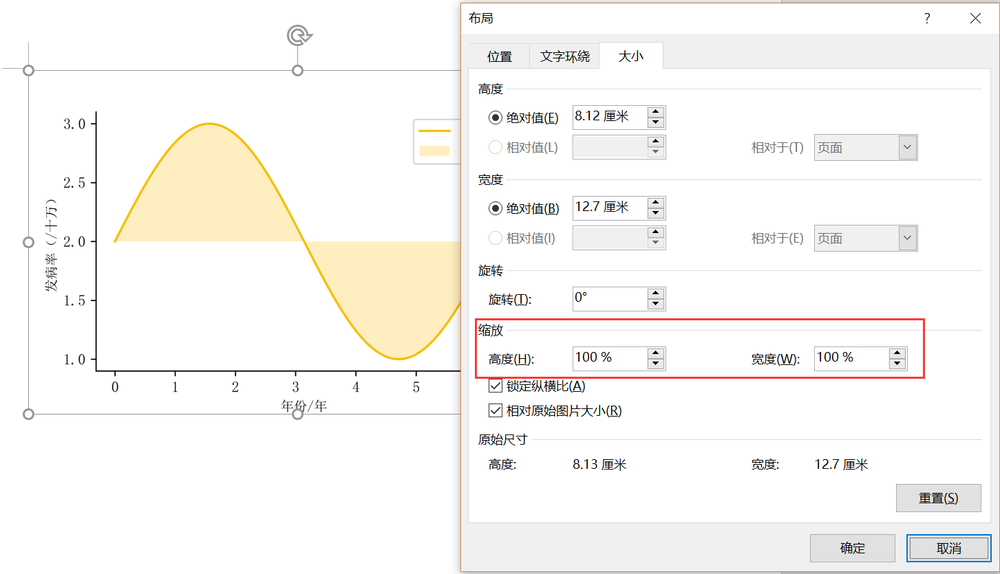

# plot_for_paper
A simple python script to generate standard graph for paper based on matplotlib.

The font file should be put into ~\Anaconda3\Lib\site-packages\matplotlib\mpl-data\fonts folder.

Delete all files from C:\Users\Your name\\.matplotlib to clean the cache.

Run the code, and make sure the font file is loaded correctly.

```python
import matplotlib.pyplot as plt  
import numpy as np  
import matplotlib as mpl  

mpl.rcParams['font.family'] = 'sans-serif'  
mpl.rcParams['font.sans-serif'] = ['SimSun','Times New Roman'] #中文为宋体，英文数字为新罗马
mpl.rcParams['axes.unicode_minus'] = False #解决保存图像是负号'-'显示为方块的问题  
  
x=np.arange(0,2*np.pi,0.01)
y=np.sin(x)+2

fig=plt.figure(figsize = (5, 3.2))#尺寸 单位为英寸
ax=fig.add_subplot(111)
ax.spines['right'].set_visible(False)
ax.spines['top'].set_visible(False)#去掉右侧和顶部的框线

plt.plot(x,y, '-',color='#f5bf03',label='line1')  #线条
plt.fill_between(x,y, y[0], facecolor='#FFEEC0',label='Gain', alpha=1)#填充
plt.xlabel('年份/年',fontsize = 9) #size=9 为小五
plt.ylabel('发病率（/十万）',fontsize = 9)  
plt.legend()   #图例
plt.savefig('test1.png',dpi=600)#保存为图片文件，dpi最好300到600。
plt.show()#显示和保存的效果不一样，以保存的图片为准
```


If you put the picture in your word, remember do not zoom in and out. If the size is not suitable for your document, you can change the figsize.


